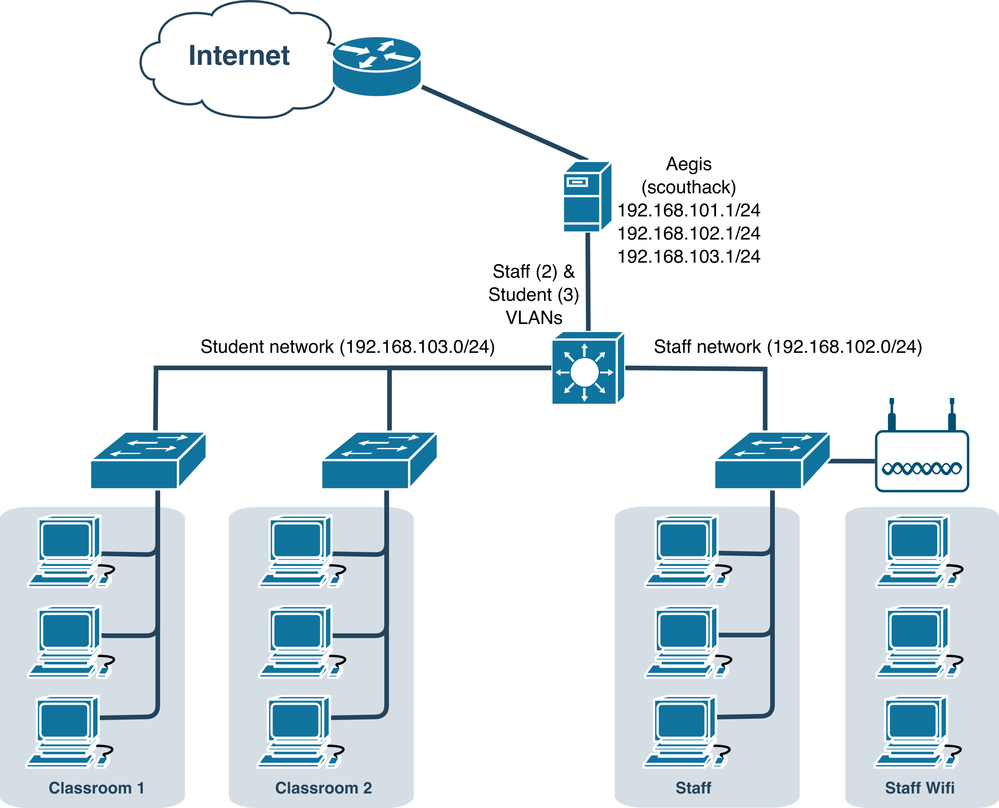
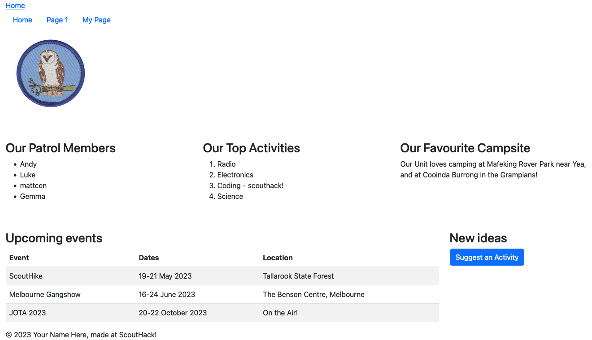
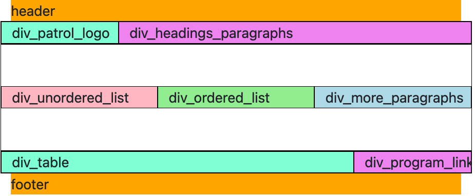
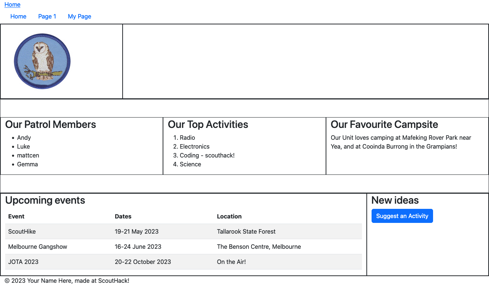
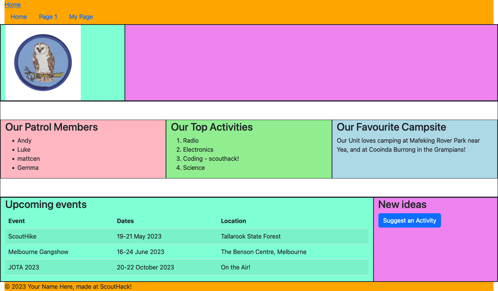

 <!-- .element style="max-height: 750px" -->

---

 <!-- .element style="max-height: 750px" -->

---

 <!-- .element style="max-height: 750px" -->

---

## What we're building

[]() <!-- .element style="max-height: 650px" -->

---

## HTML page overview

```html
<!DOCTYPE html>
<html lang="en">

<head>
    <meta charset="UTF-8">
    <meta http-equiv="X-UA-Compatible" content="IE=edge">
    <meta name="viewport" content="width=device-width, initial-scale=1.0">
    <title></title>
</head>
<body>
    <div id="div_content">
        <section>
            <!--x block header x-->
        </section>
        <section>
            <!--x block content x-->
        </section>
        <section>
            <!--x block footer x-->
        </section>
    </div>
</body>
</html>
```

Note:

## Create skeleton HTML document

- *All* our code goes in a `<html>` tag
- Inside `<html>` we have a `<head>`, and a `<body>`
- `<head>` contains a `<title>` - shows at top of browser window
- `<body>` is where all the action happens
- `<div>` tags act as containers. Some of them have IDs so we can refer to them later
- All IDs must be unique
- `div_content` has three `<section>`s: header, content, and footer

---

## HTML page detail

```html [13-19|21-43|45-53|54-60]
<!DOCTYPE html>
<html lang="en">

<head>
    <meta charset="UTF-8">
    <meta http-equiv="X-UA-Compatible" content="IE=edge">
    <meta name="viewport" content="width=device-width, initial-scale=1.0">
    <title></title>
</head>

<body>
    <div id="div_content">
        <section>
            <!--x block header x-->
            <header>
                <!-- Put your menu links here -->
            </header>
            <!--x endblock header x-->
        </section>

        <section>
            <!--x block content x-->

            <div id="div_first_content">
                <div id="div_patrol_logo">
                    <!-- Put your Patrol logo here! -->
                </div>

                <div id="div_headings_paragaphs">
                    <!-- Heading and Paragraphs -->
                </div>
            </div>
            <div id="div_second_content">
                <div id="div_unordered_list">
                    <!-- Unordered list-->
                </div>
                <div id="div_ordered_list">
                    <!-- Ordered list -->
                </div>
                <div id="div_more_paragraphs">
                    <!-- Paragraph -->
                </div>
            </div>

            <div id="div_third_content">
                <div id="div_table">
                </div>
                <div id="div_program_link">
                </div>
            </div>

            <!--x endblock content x-->
        </section>

        <section>
            <!--x block footer x-->
            <footer>
            </footer>
            <!--x endblock footer x-->
        </section>
    </div>

</body>

</html>
```

Note:

- We have some `<!-- comments -->`; ignored by browser, but useful to us
- We've added some special ones that have `x`es in them: `<!--x like this x-->`
- We'll be changing these later, so wanted to make them stand out
- Three separate content sections:
    - div_first_content: Here we'll be putting an image and some text.
    - div_second_content: Here we'll be putting some lists and more text
    - div_third_content: Here we'll be putting a table and a link to another
      page

---

## Final layout preview



Note:

In almost all cases, only the inner-most divs have visible content; the outer divs are just used for structuring these inner-divs.

<table>
<tr><td style="border: 1px solid" colspan="12">header</td></tr>
<tr><td style="border: 1px solid" colspan="3">div_patrol_logo</td><td style="border: 1px solid" colspan="9">div_headings_paragraphs</td></tr>
<tr><td>&nbsp;</td></tr>
<tr><td style="border: 1px solid" colspan="4">div_unordered_list</td><td style="border: 1px solid" colspan="4">div_ordered_list</td><td style="border: 1px solid" colspan="4">div_more_paragraphs</td></tr>
<tr><td>&nbsp;</td></tr>
<tr><td style="border: 1px solid" colspan="9">div_table</td><td style="border: 1px solid" colspan="3">div_program_link</td></tr>
<tr><td style="border: 1px solid" colspan="12">footer</td></tr>
</table>

---
## Final web page preview
 <!-- .element style="max-height: 650px" -->
----
## Final web page preview
 <!-- .element style="max-height: 650px" -->
----
## Final web page preview
 <!-- .element style="max-height: 650px" -->

---
## For comparison
 <!-- .element style="max-width: 690px; vertical-align: middle" -->
 <!-- .element style="max-width: 690px; vertical-align: middle" -->

---
## Add a patrol image [\*](http://git.scouthack/scouthack/scouthack_webdev_walkthrough/commit/a4f1833801f8e41e62f5f7ae195b73f25dfefce1)


```diff []
diff --git a/index.html b/index.html
index aba46f5..8f6c269 100644
--- a/index.html
+++ b/index.html
@@ -24,6 +24,7 @@
             <div id="div_first_content">
                 <div id="div_patrol_logo">
                     <!-- Put your Patrol logo here! -->
+                    
                 </div>
                 <div id="div_headings_paragraphs">
                     <!-- Heading and Paragraphs -->
diff --git a/static/img/scorpion.jpg b/static/img/scorpion.jpg
new file mode 100644
index 0000000..b59f28f
Binary files /dev/null and b/static/img/scorpion.jpg differ
```

Note:

- Create `static/img` folder
- Scouts have a `share/patrols` folder in their `code` folder
- Pick a patrol image, copy it to `static/img`
- Add `` tag to `index.html`

---

## Add unordered list of Patrol members [\*](http://git.scouthack/scouthack/scouthack_webdev_walkthrough/commit/0e34be1563ec5b00f04753cbc01a7045dc661c05)


```diff []
diff --git a/index.html b/index.html
index 8f6c269..2b2c8d1 100644
--- a/index.html
+++ b/index.html
@@ -38,7 +38,14 @@
 
             <div id="div_second_content">
                 <div id="div_unordered_list">
+                    <h3>Our Patrol Members</h3>
                     <!-- Unordered list -->
+                    <ul>
+                        <li>Andy</li>
+                        <li>Luke</li>
+                        <li>scouthack</li>
+                        <li>Gemma</li>
+                    </ul>
                 </div>
                 <div id="div_ordered_list">
                     <!-- Ordered list -->
```

Note:

- Create the `<h3>`
- Create the list
- Note `<li>` are *inside* ("nested within") the `<ul>`
- Most HTML elements can nest (except void elements)
- Nesting is conventionally shown by indentation
- Vertical lines in VS Code help show which block you're in

---

## Add an ordered list of our favourite activities [\*](http://git.scouthack/scouthack/scouthack_webdev_walkthrough/commit/c23129be4c692cf6acb427b50e7289f1a3aba90e)

```diff []
diff --git a/index.html b/index.html
index 2b2c8d1..a093214 100644
--- a/index.html
+++ b/index.html
@@ -48,7 +48,14 @@
                     </ul>
                 </div>
                 <div id="div_ordered_list">
+                    <h3>Our Top Activities</h3>
                     <!-- Ordered list -->
+                    <ol>
+                        <li>Radio</li>
+                        <li>Electronics</li>
+                        <li>Coding - scouthack!</li>
+                        <li>Science</li>
+                    </ol>
                 </div>
                 <div id="div_more_paragraphs">
                     <!-- Paragraph -->
```

---

## Add favourite campsite [\*](http://git.scouthack/scouthack/scouthack_webdev_walkthrough/commit/1ce7cfbccbe4a008264864a21332084c7dbd5121)

```diff []
diff --git a/index.html b/index.html
index a093214..15e1b59 100644
--- a/index.html
+++ b/index.html
@@ -58,7 +58,10 @@
                     </ol>
                 </div>
                 <div id="div_more_paragraphs">
+                    <h3>Our Favourite Campsite</h3>
                     <!-- Paragraph -->
+                    <p>Our Unit loves camping at Mafeking Rover Park near Yea, and at Cooinda Burrong in the Grampians!
+                    </p>
                 </div>
             </div>
 
```

---

## Add a table of upcoming events [\*](http://git.scouthack/scouthack/scouthack_webdev_walkthrough/commit/731963d092c453570f5cfa7d98a1c685f90952a6)

```
table>(thead>tr>th[scope="col"]*3)+tbody>(tr>td*3)*3
```

```diff []
diff --git a/index.html b/index.html
index 15e1b59..97c05e3 100644
--- a/index.html
+++ b/index.html
@@ -67,7 +67,34 @@
 
             <div id="div_third_content">
                 <div id="div_table">
+                    <h3>Upcoming events</h3>
                     <!-- Table -->
+                    <table class="table table-striped">
+                        <thead>
+                            <tr>
+                                <th scope="col">Event</th>
+                                <th scope="col">Dates</th>
+                                <th scope="col">Location</th>
+                            </tr>
+                        </thead>
+                        <tbody>
+                            <tr>
+                                <td>ScoutHike</td>
+                                <td>19-21 May 2023</td>
+                                <td>Tallarook State Forest</td>
+                            </tr>
+                            <tr>
+                                <td>Melbourne Gangshow</td>
+                                <td>16-24 June 2023</td>
+                                <td>The Besen Centre, Melbourne</td>
+                            </tr>
+                            <tr>
+                                <td>JOTA 2023</td>
+                                <td>20-22 October 2023</td>
+                                <td>On the Air!</td>
+                            </tr>
+                        </tbody>
+                    </table>
                 </div>
                 <div id="div_program_link">
                 </div>
```

Note:

- Table with heading and 3 rows
- Lots of stuff to write, so let's use an Emmet abbreviation

---

## Add a copyright notice [\*](http://git.scouthack/scouthack/scouthack_webdev_walkthrough/commit/1b6bae77287b27c582b02f4dc5a296fc63f5cdcb)

```diff []
diff --git a/index.html b/index.html
index 6456b48..fc131d4 100644
--- a/index.html
+++ b/index.html
@@ -106,6 +106,7 @@
         <section>
             <!--x block footer x-->
             <footer>
+                <p>&copy; 2023 Your Name Here, made at ScoutHack!</p>
             </footer>
             <!--x endblock footer x-->
         </section>
```

Note:

- We use `&copy;` to add a Copyright symbol
- There are plenty of other symbols we could use too; this is just one of many

---

## Create a navigation menu linking to a second page [\*](http://git.scouthack/scouthack/scouthack_webdev_walkthrough/commit/b1239facf6e9b956304e6961b604f496ed5a2c91)


```diff []
diff --git a/index.html b/index.html
index fc131d4..a449286 100644
--- a/index.html
+++ b/index.html
@@ -14,6 +14,10 @@
             <!--x block header x-->
             <header>
                 <!-- Put your menu links here -->
+                <ul>
+                    <li><a href="/">Home</a></li>
+                    <li><a href="my-page.html">My Page</a></li>
+                </ul>
             </header>
             <!--x endblock header x-->
         </section>
diff --git a/my-page.html b/my-page.html
new file mode 100644
index 0000000..3f16992
--- /dev/null
+++ b/my-page.html
@@ -0,0 +1,6 @@
+<h1>My Page</h1>
+<ul>
+    <li><a href="/">Home</a></li>
+    <li><a href="my-page.html">My Page</a></li>
+</ul>
+<p>Hello world! This is my page</p>
```

Note:

- Create a `<ul>` for our main menu
- 2 hyperlinks for now: `/` ("Home"), and `my-page.html` ("My Page" - the play
  page we were using earlier).
- We use `/` instead of `index.html` because the latter is implied
- Suggest also adding a menu to `my-page.html` to get back Home

---

## Add links to our Program Ideas page [\*](http://git.scouthack/scouthack/scouthack_webdev_walkthrough/commit/790d4b3b91cdb5e8e42093705c143098745cdb26)

```diff []
diff --git a/index.html b/index.html
index a449286..4e7e587 100644
--- a/index.html
+++ b/index.html
@@ -17,6 +17,7 @@
                 <ul>
                     <li><a href="/">Home</a></li>
                     <li><a href="my-page.html">My Page</a></li>
+                    <li><a href="">Program Ideas</a></li>
                 </ul>
             </header>
             <!--x endblock header x-->
@@ -101,6 +102,8 @@
                     </table>
                 </div>
                 <div id="div_program_link">
+                    <h3>New ideas</h3>
+                    <a href="" target="_blank">Suggest an Activity</a>
                 </div>
             </div>
 
```

Note:

- Create links to "Program" pages; currently no "href" for now.

---

## Inline CSS Styles [\*](http://git.scouthack/scouthack/scouthack_webdev_walkthrough/commit/d2e7c2f0549418ba6253c4248e3b722e2d576cd2)

```html
<p>Hello world</p>
```

```html
<p style="color: red">Hello world</p>
```

```diff [8-10,17-19]
diff --git a/index.html b/index.html
index 4e7e587..fd20a57 100644
--- a/index.html
+++ b/index.html
@@ -43,7 +43,7 @@
 
             <div id="div_second_content">
                 <div id="div_unordered_list">
-                    <h3>Our Patrol Members</h3>
+                    <h3 style="color: orange">Our Patrol Members</h3>
                     <!-- Unordered list -->
                     <ul>
                         <li>Andy</li>
@@ -53,7 +53,7 @@
                     </ul>
                 </div>
                 <div id="div_ordered_list">
-                    <h3>Our Top Activities</h3>
+                    <h3 style="font-family: Impact">Our Top Activities</h3>
                     <!-- Ordered list -->
                     <ol>
                         <li>Radio</li>
```
<!-- .element class="fragment" -->

---

## Switch to external stylesheet [\*](http://git.scouthack/scouthack/scouthack_webdev_walkthrough/commit/e7ca34a26c537dc908a3bbc090a026dff16c83d0)

```diff     <title>Scorpion Patrol</title>
+    <style>
+        .heading_a {
+            color: orange;
+        }
+        .heading_b {
+            font-family: Impact;
+        }
+    </style>
 </head>
```

Note:

- CSS can apply to multiple elements - but not with inline styles
- CSS Selectors allow us to style many elements at once
- In addition to inline, CSS can go in the header (internal), or a separate
  file (external)

----

## Switch to external stylesheet [\*](http://git.scouthack/scouthack/scouthack_webdev_walkthrough/commit/e7ca34a26c537dc908a3bbc090a026dff16c83d0)

`static/css/style.css`:
```css
.heading_a {
    color: orange;
}
.heading_b {
    font-family: Impact;
}
```

Head of `index.html`:
```html
<link href="static/css/style.css" rel="stylesheet">
```

Note:

- We're skipping "internal" stylesheets, going straight to "external"
- Create "css" folder inside "static" folder
- Create "style.css" file in "static/css"

----

## Switch to external stylesheet [\*](http://git.scouthack/scouthack/scouthack_webdev_walkthrough/commit/e7ca34a26c537dc908a3bbc090a026dff16c83d0)

Reference CSS classes using `.`:
```css
.heading_a { color: orange; }
```

Reference all `<h3>` elements using:
```css
h3 { color: orange; }
```

Give a specific element an ID (must be unique)
```html
<h3 id="my_special_heading">Special heading!</h3>
```

Reference that ID with `#`:
```css
 #my_special_heading { color: orange; }
```

Note:

- External stylesheets can apply to multiple pages
- CSS selectors specify what the CSS applies to
- Selectors for element types, classes, and IDs.

----

## Switch to external stylesheet [\*](http://git.scouthack/scouthack/scouthack_webdev_walkthrough/commit/e7ca34a26c537dc908a3bbc090a026dff16c83d0)

```diff [9,16-18]
diff --git a/index.html b/index.html
index fd20a57..d724f09 100644
--- a/index.html
+++ b/index.html
@@ -6,6 +6,7 @@
     <meta http-equiv="X-UA-Compatible" content="IE=edge">
     <meta name="viewport" content="width=device-width, initial-scale=1.0">
     <title>Scorpion Patrol</title>
+    <link href="static/css/style.css" rel="stylesheet">
 </head>
 
 <body>
@@ -43,7 +44,7 @@
 
             <div id="div_second_content">
                 <div id="div_unordered_list">
-                    <h3 style="color: orange">Our Patrol Members</h3>
+                    <h3 class="heading_a">Our Patrol Members</h3>
                     <!-- Unordered list -->
                     <ul>
                         <li>Andy</li>
@@ -53,7 +54,7 @@
                     </ul>
                 </div>
                 <div id="div_ordered_list">
-                    <h3 style="font-family: Impact">Our Top Activities</h3>
+                    <h3 class="heading_b">Our Top Activities</h3>
                     <!-- Ordered list -->
                     <ol>
                         <li>Radio</li>
diff --git a/static/css/style.css b/static/css/style.css
new file mode 100644
index 0000000..98a84ba
--- /dev/null
+++ b/static/css/style.css
@@ -0,0 +1,6 @@
+.heading_a {
+    color: orange;
+}
+.heading_b {
+    font-family: Impact;
+}
```
---

## More colours and fonts [\*](http://git.scouthack/scouthack/scouthack_webdev_walkthrough/commit/d8e41410065318b5842895f779eed4ec02e9dce7)

Several ways to show colours:

- By name: `green` <!-- .element style="color: green" -->
- Using decimal RGB: `RGB(255, 201, 12)` <!-- .element style="color: RGB(255, 201, 12)" -->
- Using hexadecimal: `#ffc90c` <!-- .element style="color: #ffc90c" -->

(RGB stands for Red, Green, Blue)

Note:

- Three colour type:
    - keyword
    - decimal RGB
    - hexadecimal

----

## More colours and fonts [\*](http://git.scouthack/scouthack/scouthack_webdev_walkthrough/commit/d8e41410065318b5842895f779eed4ec02e9dce7)

```diff [8-10|19-31]
diff --git a/index.html b/index.html
index d724f09..e66b40f 100644
--- a/index.html
+++ b/index.html
@@ -64,7 +64,7 @@
                     </ol>
                 </div>
                 <div id="div_more_paragraphs">
-                    <h3>Our Favourite Campsite</h3>
+                    <h3 class="heading_c">Our Favourite Campsite</h3>
                     <!-- Paragraph -->
                     <p>Our Unit loves camping at Mafeking Rover Park near Yea, and at Cooinda Burrong in the Grampians!
                     </p>
diff --git a/static/css/style.css b/static/css/style.css
index 98a84ba..a7f8d91 100644
--- a/static/css/style.css
+++ b/static/css/style.css
@@ -1,6 +1,12 @@
 .heading_a {
-    color: orange;
+    color: rgb(200, 100, 109);
+    font-family: "Courier New";
 }
 .heading_b {
+    color: green;
     font-family: Impact;
 }
+.heading_c {
+    color: #ffc90c;
+    font-family: Georgia;
+}
```

Note:

- Adding a couple of differently formatted colours
- Also some different fonts

---

## Add a style to headings in only one section [\*](http://git.scouthack/scouthack/scouthack_webdev_walkthrough/commit/cb37138a715ade6b2e41c07ff867c452b7352221)


```diff [9-11]
diff --git a/static/css/style.css b/static/css/style.css
index a7f8d91..905abd7 100644
--- a/static/css/style.css
+++ b/static/css/style.css
@@ -10,3 +10,6 @@
     color: #ffc90c;
     font-family: Georgia;
 }
+#div_third_content h3 {
+    color: salmon;
+}
```

Note:

- Styling an element using ID
- Also using *two* CSS selectors to select the `<h3>`s inside the div

---

## Adding Bootstrap [\*](http://git.scouthack/scouthack/scouthack_webdev_walkthrough/commit/e4f1fb8f8cfedbca89a4afef122becaf7c3f90af)

```diff [9]
diff --git a/index.html b/index.html
index e66b40f..92ea98c 100644
--- a/index.html
+++ b/index.html
@@ -6,6 +6,7 @@
     <meta http-equiv="X-UA-Compatible" content="IE=edge">
     <meta name="viewport" content="width=device-width, initial-scale=1.0">
     <title>Scorpion Patrol</title>
+    <link href="http://cdn.scouthack/bootstrap.min.css" rel="stylesheet">
     <link href="static/css/style.css" rel="stylesheet">
 </head>
 
```

Note:

- Bootstrap has many built-in classes we can use rather than write our own
- Add Bootstrap CSS and see what happens
- Note we're pulling from `cdn.scouthack`; our own content distribution network. Could also pull from the internet

---

## Using containers [\*](http://git.scouthack/scouthack/scouthack_webdev_walkthrough/commit/8dbfdd3feceadb2730f307d0966fe0fe4ad745ce)


```diff [9-10]
diff --git a/index.html b/index.html
index 92ea98c..6c535c6 100644
--- a/index.html
+++ b/index.html
@@ -11,7 +11,7 @@
 </head>
 
 <body>
-    <div id="div_content">
+    <div id="div_content" class="container">
         <section>
             <!--x block header x-->
             <header>
```

Note:

- Containers limit the width of our content
- Refresh to see what this does

---

## Style our navigation bar [\*](http://git.scouthack/scouthack/scouthack_webdev_walkthrough/commit/8063675245fcc7ff6ea486d23d40da28b9a55631)

```diff [9-16]
diff --git a/index.html b/index.html
index 6c535c6..fa774be 100644
--- a/index.html
+++ b/index.html
@@ -16,10 +16,10 @@
             <!--x block header x-->
             <header>
                 <!-- Put your menu links here -->
-                <ul>
-                    <li><a href="/">Home</a></li>
-                    <li><a href="my-page.html">My Page</a></li>
-                    <li><a href="">Program Ideas</a></li>
+                <ul class="nav nav-pills">
+                    <li class="nav-item"><a class="nav-link" href="/">Home</a></li>
+                    <li class="nav-item"><a class="nav-link" href="my-page.html">My Page</a></li>
+                    <li class="nav-item"><a class="nav-link" href="program.html">Program Ideas</a></li>
                 </ul>
             </header>
             <!--x endblock header x-->
```

Note:

- `nav` and `nav-pills` tells Bootstrap this is a navigation bar
- `nav-item` tells it to style the individual list items

---

## Add a Bootstrap row and columns [\*](http://git.scouthack/scouthack/scouthack_webdev_walkthrough/commit/d58f64a7cc192b291bc806a71a9adc2b4544753d)


```diff [9-12,16-17]
diff --git a/index.html b/index.html
index fa774be..592d10d 100644
--- a/index.html
+++ b/index.html
@@ -28,12 +28,12 @@
         <section>
             <!--x block content x-->
 
-            <div id="div_first_content">
-                <div id="div_patrol_logo">
+            <div id="div_first_content" class="row">
+                <div id="div_patrol_logo" class="col-3">
                     <!-- Put your Patrol logo here! -->
                     
                 </div>
-                <div id="div_headings_paragraphs">
+                <div id="div_headings_paragraphs" class="col-9">
                     <!-- Heading and Paragraphs -->
                     <h3>Welcome to the Scorpion Patrol</h3>
                     <p>This is our Program Planning site where we share our program information and add new program
```

Note:

- Bootstrap can divide web pages into rows and columns
- A row has 12 equal columns
- We use a `row` class on a `<div>`, and then `col` classes on the `<div>`s inside it.
- `col-3` specifies to take up 3/12 of the width, `col-9` specifies 9/12 widith

---

## More rows and columns [\*](http://git.scouthack/scouthack/scouthack_webdev_walkthrough/commit/9c194ff191d2dffda9eb8bd0d8d1f85c9892df52)


```diff [9-12,20-21]
diff --git a/index.html b/index.html
index 592d10d..51b4f93 100644
--- a/index.html
+++ b/index.html
@@ -43,8 +43,8 @@
                 </div>
             </div>
 
-            <div id="div_second_content">
-                <div id="div_unordered_list">
+            <div id="div_second_content" class="row py-5">
+                <div id="div_unordered_list" class="col-4">
                     <h3 class="heading_a">Our Patrol Members</h3>
                     <!-- Unordered list -->
                     <ul>
@@ -54,7 +54,7 @@
                         <li>Gemma</li>
                     </ul>
                 </div>
-                <div id="div_ordered_list">
+                <div id="div_ordered_list" class="col-4">
                     <h3 class="heading_b">Our Top Activities</h3>
                     <!-- Ordered list -->
                     <ol>
@@ -64,7 +64,7 @@
                         <li>Science</li>
                     </ol>
                 </div>
-                <div id="div_more_paragraphs">
+                <div id="div_more_paragraphs" class="col-4">
                     <h3 class="heading_c">Our Favourite Campsite</h3>
                     <!-- Paragraph -->
                     <p>Our Unit loves camping at Mafeking Rover Park near Yea, and at Cooinda Burrong in the Grampians!
@@ -72,8 +72,8 @@
                 </div>
             </div>
 
-            <div id="div_third_content">
-                <div id="div_table">
+            <div id="div_third_content" class="row">
+                <div id="div_table" class="col-9">
                     <h3>Upcoming events</h3>
                     <!-- Table -->
                     <table>
@@ -103,7 +103,7 @@
                         </tbody>
                     </table>
                 </div>
-                <div id="div_program_link">
+                <div id="div_program_link" class="col-3">
                     <h3>New ideas</h3>
                     <a href="" target="_blank">Suggest an Activity</a>
                 </div>
```

Note:

- Repeat for other divs
- Second row is equal thirds
- Third row is 9/12 for table, 3/12 for link
- Second row also has `py-5`: "pad y-axis 5 units"

---

## Add Bootstrap classes to our table [\*](http://git.scouthack/scouthack/scouthack_webdev_walkthrough/commit/03fc0cb8aa323e039f69a1a01e2890f699b4cf4c)


```diff [9-10]
diff --git a/index.html b/index.html
index 51b4f93..2b539c4 100644
--- a/index.html
+++ b/index.html
@@ -76,7 +76,7 @@
                 <div id="div_table" class="col-9">
                     <h3>Upcoming events</h3>
                     <!-- Table -->
-                    <table>
+                    <table class="table table-striped">
                         <thead>
                             <tr>
                                 <th scope="col">Event</th>
```

Note:

- Give our table alternating highlighted rows

---

## Style our link as a button [\*](http://git.scouthack/scouthack/scouthack_webdev_walkthrough/commit/027472adb5a2f1b1cfdaab859132b0f0590b253f)

```diff [9-10]
diff --git a/index.html b/index.html
index 2b539c4..f832900 100644
--- a/index.html
+++ b/index.html
@@ -105,7 +105,7 @@
                 </div>
                 <div id="div_program_link" class="col-3">
                     <h3>New ideas</h3>
-                    <a href="" target="_blank">Suggest an Activity</a>
+                    <a href="" target="_blank" class="btn btn-primary">Suggest an Activity</a>
                 </div>
             </div>
 
```

Note:

- `btn` class adds (invisible) rounded rectangle
- `btn-primary` adds colour
- Lots of colour classes:
    - btn-primary
    - btn-secondary
    - btn-success
    - btn-danger
    - btn-warning
    - btn-info
    - btn-light
    - btn-dark
    - btn-link

---

## Change body background and button colour [\*](http://git.scouthack/scouthack/scouthack_webdev_walkthrough/commit/277366fca43fe1bf555f8e457c0080d31fa2a400)

```diff [9-17]
diff --git a/static/css/style.css b/static/css/style.css
index 905abd7..9ed7fbf 100644
--- a/static/css/style.css
+++ b/static/css/style.css
@@ -13,3 +13,12 @@
 #div_third_content h3 {
     color: salmon;
 }
+body {
+    background-color: #ffc90c;
+}
+.container {
+    background-color: white;
+}
+.btn-primary {
+    background-color: purple;
+}
```

Note:

- Re-colouring the body
- Everything else would inherit that background, so we override it in `.container`
- Can also override colours specified by Bootstrap, like `btn-primary`
