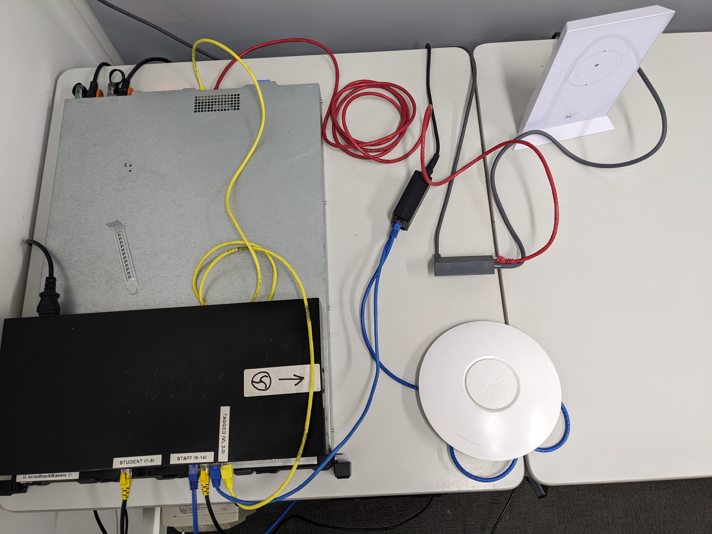

 <!-- .element style="max-height: 750px" -->

---

 <!-- .element style="max-height: 750px" -->

---

 <!-- .element style="max-height: 750px" -->

---

#### What we're building

[]() <!-- .element style="max-height: 650px" -->

---

#### HTML page overview

```html
<!DOCTYPE html>
<html lang="en">

<head>
    <meta charset="UTF-8">
    <meta http-equiv="X-UA-Compatible" content="IE=edge">
    <meta name="viewport" content="width=device-width, initial-scale=1.0">
    <title></title>
</head>
<body>
    <div id="div_content">
        <section>
            <!--x block header x-->
        </section>
        <section>
            <!--x block content x-->
        </section>
        <section>
            <!--x block footer x-->
        </section>
    </div>
</body>
</html>
```

Note:

#### Create skeleton HTML document [\*](http://git.scouthack/scouthack/scouthack_webdev_walkthrough/commit/ec8e46381e0fe3dfd0f70f76d158650b77920d4a)

- *All* our code goes in a `<html>` tag
- Inside `<html>` we have a `<head>`, and a `<body>`
- `<head>` contains a `<title>` - shows at top of browser window
- `<body>` is where all the action happens
- `<div>` tags act as containers. Some of them have IDs so we can refer to them later
- All IDs must be unique
- `div_content` has three `<section>`s: header, content, and footer

---

#### HTML page detail

```html [13-19|21-43|45-53|54-60]
<!DOCTYPE html>
<html lang="en">

<head>
    <meta charset="UTF-8">
    <meta http-equiv="X-UA-Compatible" content="IE=edge">
    <meta name="viewport" content="width=device-width, initial-scale=1.0">
    <title></title>
</head>

<body>
    <div id="div_content">
        <section>
            <!--x block header x-->
            <header>
                <!-- Put your menu links here -->
            </header>
            <!--x endblock header x-->
        </section>

        <section>
            <!--x block content x-->

            <div id="div_first_content">
                <div id="div_patrol_logo">
                    <!-- Put your Patrol logo here! -->
                </div>

                <div id="div_headings_paragaphs">
                    <!-- Heading and Paragraphs -->
                </div>
            </div>
            <div id="div_second_content">
                <div id="div_unordered_list">
                    <!-- Unordered list-->
                </div>
                <div id="div_ordered_list">
                    <!-- Ordered list -->
                </div>
                <div id="div_more_paragraphs">
                    <!-- Paragraph -->
                </div>
            </div>

            <div id="div_third_content">
                <div id="div_table">
                </div>
                <div id="div_program_link">
                </div>
            </div>

            <!--x endblock content x-->
        </section>

        <section>
            <!--x block footer x-->
            <footer>
            </footer>
            <!--x endblock footer x-->
        </section>
    </div>

</body>

</html>
```

Note:

- We have some `<!-- comments -->`; ignored by browser, but useful to us
- We've added some special ones that have `x`es in them: `<!--x like this x-->`
- We'll be changing these later, so wanted to make them stand out
- Three separate content sections:
    - div_first_content: Here we'll be putting an image and some text.
    - div_second_content: Here we'll be putting some lists and more text
    - div_third_content: Here we'll be putting a table and a link to another
      page

---

#### Final layout preview


Note:

In almost all cases, only the inner-most divs have visible content; the outer divs are just used for structuring these inner-divs.

<table>
<tr><td style="border: 1px solid" colspan="12">header</td></tr>
<tr><td style="border: 1px solid" colspan="3">div_patrol_logo</td><td style="border: 1px solid" colspan="9">div_headings_paragraphs</td></tr>
<tr><td>&nbsp;</td></tr>
<tr><td style="border: 1px solid" colspan="4">div_unordered_list</td><td style="border: 1px solid" colspan="4">div_ordered_list</td><td style="border: 1px solid" colspan="4">div_more_paragraphs</td></tr>
<tr><td>&nbsp;</td></tr>
<tr><td style="border: 1px solid" colspan="9">div_table</td><td style="border: 1px solid" colspan="3">div_program_link</td></tr>
<tr><td style="border: 1px solid" colspan="12">footer</td></tr>
</table>

---
#### Final web page preview
 <!-- .element style="max-height: 650px" -->
----
#### Final web page preview
 <!-- .element style="max-height: 650px" -->
----
#### Final web page preview
 <!-- .element style="max-height: 650px" -->

---
#### For comparison
 <!-- .element style="max-width: 690px; vertical-align: middle" -->
 <!-- .element style="max-width: 690px; vertical-align: middle" -->

---
#### Add a patrol image [\*](http://git.scouthack/scouthack/scouthack_webdev_walkthrough/commit/a4f1833801f8e41e62f5f7ae195b73f25dfefce1)


```diff []
diff --git a/index.html b/index.html
index aba46f5..8f6c269 100644
--- a/index.html
+++ b/index.html
@@ -24,6 +24,7 @@
             <div id="div_first_content">
                 <div id="div_patrol_logo">
                     <!-- Put your Patrol logo here! -->
+                    
                 </div>
                 <div id="div_headings_paragraphs">
                     <!-- Heading and Paragraphs -->
diff --git a/static/img/scorpion.jpg b/static/img/scorpion.jpg
new file mode 100644
index 0000000..b59f28f
Binary files /dev/null and b/static/img/scorpion.jpg differ
```

Note:

- Create `static/img` folder
- Scouts have a `share/patrols` folder in their `code` folder
- Pick a patrol image, copy it to `static/img`
- Add `` tag to `index.html`

---

#### Add unordered list of Patrol members [\*](http://git.scouthack/scouthack/scouthack_webdev_walkthrough/commit/0e34be1563ec5b00f04753cbc01a7045dc661c05)


```diff []
diff --git a/index.html b/index.html
index 8f6c269..2b2c8d1 100644
--- a/index.html
+++ b/index.html
@@ -38,7 +38,14 @@
 
             <div id="div_second_content">
                 <div id="div_unordered_list">
+                    <h3>Our Patrol Members</h3>
                     <!-- Unordered list -->
+                    <ul>
+                        <li>Andy</li>
+                        <li>Luke</li>
+                        <li>scouthack</li>
+                        <li>Gemma</li>
+                    </ul>
                 </div>
                 <div id="div_ordered_list">
                     <!-- Ordered list -->
```

Note:

- Create the `<h3>`
- Create the list
- Note `<li>` are *inside* ("nested within") the `<ul>`
- Most HTML elements can nest (except void elements)
- Nesting is conventionally shown by indentation
- Vertical lines in VS Code help show which block you're in

---

#### Add an ordered list of our favourite activities [\*](http://git.scouthack/scouthack/scouthack_webdev_walkthrough/commit/c23129be4c692cf6acb427b50e7289f1a3aba90e)

```diff []
diff --git a/index.html b/index.html
index 2b2c8d1..a093214 100644
--- a/index.html
+++ b/index.html
@@ -48,7 +48,14 @@
                     </ul>
                 </div>
                 <div id="div_ordered_list">
+                    <h3>Our Top Activities</h3>
                     <!-- Ordered list -->
+                    <ol>
+                        <li>Radio</li>
+                        <li>Electronics</li>
+                        <li>Coding - scouthack!</li>
+                        <li>Science</li>
+                    </ol>
                 </div>
                 <div id="div_more_paragraphs">
                     <!-- Paragraph -->
```

---

#### Add favourite campsite [\*](http://git.scouthack/scouthack/scouthack_webdev_walkthrough/commit/1ce7cfbccbe4a008264864a21332084c7dbd5121)

```diff []
diff --git a/index.html b/index.html
index a093214..15e1b59 100644
--- a/index.html
+++ b/index.html
@@ -58,7 +58,10 @@
                     </ol>
                 </div>
                 <div id="div_more_paragraphs">
+                    <h3>Our Favourite Campsite</h3>
                     <!-- Paragraph -->
+                    <p>Our Unit loves camping at Mafeking Rover Park near Yea, and at Cooinda Burrong in the Grampians!
+                    </p>
                 </div>
             </div>
 
```

---

#### Add a table of upcoming events [\*](http://git.scouthack/scouthack/scouthack_webdev_walkthrough/commit/27fa6210743494b6674f2c3ee17111f8f96e2877)

```
table>(thead>tr>th[scope="col"]*3)+tbody>(tr>td*3)*3
```

```diff []
diff --git a/index.html b/index.html
index 15e1b59..97c05e3 100644
--- a/index.html
+++ b/index.html
@@ -67,7 +67,34 @@
 
             <div id="div_third_content">
                 <div id="div_table">
+                    <h3>Upcoming events</h3>
                     <!-- Table -->
+                    <table>
+                        <thead>
+                            <tr>
+                                <th scope="col">Event</th>
+                                <th scope="col">Dates</th>
+                                <th scope="col">Location</th>
+                            </tr>
+                        </thead>
+                        <tbody>
+                            <tr>
+                                <td>Cuboree 2023</td>
+                                <td>25-29 September 2023</td>
+                                <td>Gilwell Park, Gembrook</td>
+                            </tr>
+                            <tr>
+                                <td>JOTA/JOTI 2023</td>
+                                <td>20-22 October 2023</td>
+                                <td>Everywhere!</td>
+                            </tr>
+                            <tr>
+                                <td>Vic Gathering</td>
+                                <td>1-3 December 2023</td>
+                                <td>Mafeking Rover Park</td>
+                            </tr>
+                        </tbody>
+                    </table>
                 </div>
                 <div id="div_program_link">
                 </div>
```

Note:

- Table with heading and 3 rows
- Lots of stuff to write, so let's use an Emmet abbreviation

---

#### Add a copyright notice [\*](http://git.scouthack/scouthack/scouthack_webdev_walkthrough/commit/d703ff8f1ed807ab7407d968b017d8ff9ec7f823)

```diff []
diff --git a/index.html b/index.html
index 6456b48..fc131d4 100644
--- a/index.html
+++ b/index.html
@@ -106,6 +106,7 @@
         <section>
             <!--x block footer x-->
             <footer>
+                <p>&copy; 2023 Your Name Here, made at ScoutHack!</p>
             </footer>
             <!--x endblock footer x-->
         </section>
```

Note:

- We use `&copy;` to add a Copyright symbol
- There are plenty of other symbols we could use too; this is just one of many

---

#### Create a navigation menu linking to a second page [\*](http://git.scouthack/scouthack/scouthack_webdev_walkthrough/commit/7a4fe8f6a9d479b5b635d9889ae924cd9a312fd2)


```diff []
diff --git a/index.html b/index.html
index fc131d4..a449286 100644
--- a/index.html
+++ b/index.html
@@ -14,6 +14,10 @@
             <!--x block header x-->
             <header>
                 <!-- Put your menu links here -->
+                <ul>
+                    <li><a href="/">Home</a></li>
+                    <li><a href="my-page.html">My Page</a></li>
+                </ul>
             </header>
             <!--x endblock header x-->
         </section>
diff --git a/my-page.html b/my-page.html
new file mode 100644
index 0000000..3f16992
--- /dev/null
+++ b/my-page.html
@@ -0,0 +1,6 @@
+<h1>My Page</h1>
+<ul>
+    <li><a href="/">Home</a></li>
+    <li><a href="my-page.html">My Page</a></li>
+</ul>
+<p>Hello world! This is my page</p>
```

Note:

- Create a `<ul>` for our main menu
- 2 hyperlinks for now: `/` ("Home"), and `my-page.html` ("My Page" - the play
  page we were using earlier).
- We use `/` instead of `index.html` because the latter is implied
- Suggest also adding a menu to `my-page.html` to get back Home

---

#### Add links to our Program Ideas page [\*](http://git.scouthack/scouthack/scouthack_webdev_walkthrough/commit/e7b08e3921c5093037518febbba00313a5ff8257)

```diff []
diff --git a/index.html b/index.html
index a449286..4e7e587 100644
--- a/index.html
+++ b/index.html
@@ -17,6 +17,7 @@
                 <ul>
                     <li><a href="/">Home</a></li>
                     <li><a href="my-page.html">My Page</a></li>
+                    <li><a href="">Program Ideas</a></li>
                 </ul>
             </header>
             <!--x endblock header x-->
@@ -101,6 +102,8 @@
                     </table>
                 </div>
                 <div id="div_program_link">
+                    <h3>New ideas</h3>
+                    <a href="" target="_blank">Suggest an Activity</a>
                 </div>
             </div>
 
```

Note:

- Create links to "Program" pages; currently no "href" for now.

---

#### Inline CSS Styles [\*](http://git.scouthack/scouthack/scouthack_webdev_walkthrough/commit/a16d2ab2c834167295952e09eb0782a7e5a5552d)

```html
<p>Hello world</p>
```

```html
<p style="color: red">Hello world</p>
```

```diff [8-10,17-19]
diff --git a/index.html b/index.html
index 4e7e587..fd20a57 100644
--- a/index.html
+++ b/index.html
@@ -43,7 +43,7 @@
 
             <div id="div_second_content">
                 <div id="div_unordered_list">
-                    <h3>Our Patrol Members</h3>
+                    <h3 style="color: orange">Our Patrol Members</h3>
                     <!-- Unordered list -->
                     <ul>
                         <li>Andy</li>
@@ -53,7 +53,7 @@
                     </ul>
                 </div>
                 <div id="div_ordered_list">
-                    <h3>Our Top Activities</h3>
+                    <h3 style="font-family: Impact">Our Top Activities</h3>
                     <!-- Ordered list -->
                     <ol>
                         <li>Radio</li>
```
<!-- .element class="fragment" -->

---

#### Switch to external stylesheet [\*](http://git.scouthack/scouthack/scouthack_webdev_walkthrough/commit/50986db31c8bc69b074190d35b1d84be0937d071)

```diff     <title>Scorpion Patrol</title>
+    <style>
+        .heading_a {
+            color: orange;
+        }
+        .heading_b {
+            font-family: Impact;
+        }
+    </style>
 </head>
```

Note:

- CSS can apply to multiple elements - but not with inline styles
- CSS Selectors allow us to style many elements at once
- In addition to inline, CSS can go in the header (internal), or a separate
  file (external)

----

#### Switch to external stylesheet [\*](http://git.scouthack/scouthack/scouthack_webdev_walkthrough/commit/50986db31c8bc69b074190d35b1d84be0937d071)

`static/css/style.css`:
```css
.heading_a {
    color: orange;
}
.heading_b {
    font-family: Impact;
}
```

Head of `index.html`:
```html
<link href="static/css/style.css" rel="stylesheet">
```

Note:

- We're skipping "internal" stylesheets, going straight to "external"
- Create "css" folder inside "static" folder
- Create "style.css" file in "static/css"

----

#### Switch to external stylesheet [\*](http://git.scouthack/scouthack/scouthack_webdev_walkthrough/commit/50986db31c8bc69b074190d35b1d84be0937d071)

Reference CSS classes using `.`:
```css
.heading_a { color: orange; }
```

Reference all `<h3>` elements using:
```css
h3 { color: orange; }
```

Give a specific element an ID (must be unique)
```html
<h3 id="my_special_heading">Special heading!</h3>
```

Reference that ID with `#`:
```css
 #my_special_heading { color: orange; }
```

Note:

- External stylesheets can apply to multiple pages
- CSS selectors specify what the CSS applies to
- Selectors for element types, classes, and IDs.

----

#### Switch to external stylesheet [\*](http://git.scouthack/scouthack/scouthack_webdev_walkthrough/commit/50986db31c8bc69b074190d35b1d84be0937d071)

```diff [9,16-18]
diff --git a/index.html b/index.html
index fd20a57..d724f09 100644
--- a/index.html
+++ b/index.html
@@ -6,6 +6,7 @@
     <meta http-equiv="X-UA-Compatible" content="IE=edge">
     <meta name="viewport" content="width=device-width, initial-scale=1.0">
     <title>Scorpion Patrol</title>
+    <link href="static/css/style.css" rel="stylesheet">
 </head>
 
 <body>
@@ -43,7 +44,7 @@
 
             <div id="div_second_content">
                 <div id="div_unordered_list">
-                    <h3 style="color: orange">Our Patrol Members</h3>
+                    <h3 class="heading_a">Our Patrol Members</h3>
                     <!-- Unordered list -->
                     <ul>
                         <li>Andy</li>
@@ -53,7 +54,7 @@
                     </ul>
                 </div>
                 <div id="div_ordered_list">
-                    <h3 style="font-family: Impact">Our Top Activities</h3>
+                    <h3 class="heading_b">Our Top Activities</h3>
                     <!-- Ordered list -->
                     <ol>
                         <li>Radio</li>
diff --git a/static/css/style.css b/static/css/style.css
new file mode 100644
index 0000000..98a84ba
--- /dev/null
+++ b/static/css/style.css
@@ -0,0 +1,6 @@
+.heading_a {
+    color: orange;
+}
+.heading_b {
+    font-family: Impact;
+}
```
---

#### More colours and fonts [\*](http://git.scouthack/scouthack/scouthack_webdev_walkthrough/commit/69e7003851355a5dd5c1ef63e2b6926a973ad90d)

Several ways to show colours:

- By name: `green` <!-- .element style="color: green" -->
- Using decimal RGB: `RGB(255, 201, 12)` <!-- .element style="color: RGB(255, 201, 12)" -->
- Using hexadecimal: `#ffc90c` <!-- .element style="color: #ffc90c" -->

(RGB stands for Red, Green, Blue)

Note:

- Three colour type:
    - keyword
    - decimal RGB
    - hexadecimal

----

#### More colours and fonts [\*](http://git.scouthack/scouthack/scouthack_webdev_walkthrough/commit/69e7003851355a5dd5c1ef63e2b6926a973ad90d)

```diff [8-10|19-31]
diff --git a/index.html b/index.html
index d724f09..e66b40f 100644
--- a/index.html
+++ b/index.html
@@ -64,7 +64,7 @@
                     </ol>
                 </div>
                 <div id="div_more_paragraphs">
-                    <h3>Our Favourite Campsite</h3>
+                    <h3 class="heading_c">Our Favourite Campsite</h3>
                     <!-- Paragraph -->
                     <p>Our Unit loves camping at Mafeking Rover Park near Yea, and at Cooinda Burrong in the Grampians!
                     </p>
diff --git a/static/css/style.css b/static/css/style.css
index 98a84ba..a7f8d91 100644
--- a/static/css/style.css
+++ b/static/css/style.css
@@ -1,6 +1,12 @@
 .heading_a {
-    color: orange;
+    color: rgb(200, 100, 109);
+    font-family: "Courier New";
 }
 .heading_b {
+    color: green;
     font-family: Impact;
 }
+.heading_c {
+    color: #ffc90c;
+    font-family: Georgia;
+}
```

Note:

- Adding a couple of differently formatted colours
- Also some different fonts

---

#### Add a style to headings in only one section [\*](http://git.scouthack/scouthack/scouthack_webdev_walkthrough/commit/fe7d2d738d2a4fd1fe8f17d634132cf195fd8d14)


```diff [9-11]
diff --git a/static/css/style.css b/static/css/style.css
index a7f8d91..905abd7 100644
--- a/static/css/style.css
+++ b/static/css/style.css
@@ -10,3 +10,6 @@
     color: #ffc90c;
     font-family: Georgia;
 }
+#div_third_content h3 {
+    color: salmon;
+}
```

Note:

- Styling an element using ID
- Also using *two* CSS selectors to select the `<h3>`s inside the div

---

#### Adding Bootstrap [\*](http://git.scouthack/scouthack/scouthack_webdev_walkthrough/commit/2a7457bfad8984e67c693a1a423b1d05991b0df0)

```diff [9]
diff --git a/index.html b/index.html
index e66b40f..92ea98c 100644
--- a/index.html
+++ b/index.html
@@ -6,6 +6,7 @@
     <meta http-equiv="X-UA-Compatible" content="IE=edge">
     <meta name="viewport" content="width=device-width, initial-scale=1.0">
     <title>Scorpion Patrol</title>
+    <link href="http://cdn.scouthack/bootstrap.min.css" rel="stylesheet">
     <link href="static/css/style.css" rel="stylesheet">
 </head>
 
```

Note:

- Bootstrap has many built-in classes we can use rather than write our own
- Add Bootstrap CSS and see what happens
- Note we're pulling from `cdn.scouthack`; our own content distribution network. Could also pull from the internet

---

#### Using containers [\*](http://git.scouthack/scouthack/scouthack_webdev_walkthrough/commit/a1d65a75f095d946df40a3ba743ed34880cb63a4)


```diff [9-10]
diff --git a/index.html b/index.html
index 92ea98c..6c535c6 100644
--- a/index.html
+++ b/index.html
@@ -11,7 +11,7 @@
 </head>
 
 <body>
-    <div id="div_content">
+    <div id="div_content" class="container">
         <section>
             <!--x block header x-->
             <header>
```

Note:

- Containers limit the width of our content
- Refresh to see what this does

---

#### Style our navigation bar [\*](http://git.scouthack/scouthack/scouthack_webdev_walkthrough/commit/f05d84dd346e0f8364de1a61f6c921390b0c7fe6)

```diff [9-16]
diff --git a/index.html b/index.html
index 6c535c6..fa774be 100644
--- a/index.html
+++ b/index.html
@@ -16,10 +16,10 @@
             <!--x block header x-->
             <header>
                 <!-- Put your menu links here -->
-                <ul>
-                    <li><a href="/">Home</a></li>
-                    <li><a href="my-page.html">My Page</a></li>
-                    <li><a href="">Program Ideas</a></li>
+                <ul class="nav nav-pills">
+                    <li class="nav-item"><a class="nav-link" href="/">Home</a></li>
+                    <li class="nav-item"><a class="nav-link" href="my-page.html">My Page</a></li>
+                    <li class="nav-item"><a class="nav-link" href="program.html">Program Ideas</a></li>
                 </ul>
             </header>
             <!--x endblock header x-->
```

Note:

- `nav` and `nav-pills` tells Bootstrap this is a navigation bar
- `nav-item` tells it to style the individual list items

---

#### Add a Bootstrap row and columns [\*](http://git.scouthack/scouthack/scouthack_webdev_walkthrough/commit/47096d379645dc1d35da2fc56dde9ec43dcf70dc)


```diff [9-12,16-17]
diff --git a/index.html b/index.html
index fa774be..592d10d 100644
--- a/index.html
+++ b/index.html
@@ -28,12 +28,12 @@
         <section>
             <!--x block content x-->
 
-            <div id="div_first_content">
-                <div id="div_patrol_logo">
+            <div id="div_first_content" class="row">
+                <div id="div_patrol_logo" class="col-3">
                     <!-- Put your Patrol logo here! -->
                     
                 </div>
-                <div id="div_headings_paragraphs">
+                <div id="div_headings_paragraphs" class="col-9">
                     <!-- Heading and Paragraphs -->
                     <h3>Welcome to the Scorpion Patrol</h3>
                     <p>This is our Program Planning site where we share our program information and add new program
```

Note:

- Bootstrap can divide web pages into rows and columns
- A row has 12 equal columns
- We use a `row` class on a `<div>`, and then `col` classes on the `<div>`s inside it.
- `col-3` specifies to take up 3/12 of the width, `col-9` specifies 9/12 widith

---

#### More rows and columns [\*](http://git.scouthack/scouthack/scouthack_webdev_walkthrough/commit/ee82fac7e91e891c1cd986a20ce043d1b1ac3619)


```diff [9-12,20-21]
diff --git a/index.html b/index.html
index 592d10d..51b4f93 100644
--- a/index.html
+++ b/index.html
@@ -43,8 +43,8 @@
                 </div>
             </div>
 
-            <div id="div_second_content">
-                <div id="div_unordered_list">
+            <div id="div_second_content" class="row py-5">
+                <div id="div_unordered_list" class="col-4">
                     <h3 class="heading_a">Our Patrol Members</h3>
                     <!-- Unordered list -->
                     <ul>
@@ -54,7 +54,7 @@
                         <li>Gemma</li>
                     </ul>
                 </div>
-                <div id="div_ordered_list">
+                <div id="div_ordered_list" class="col-4">
                     <h3 class="heading_b">Our Top Activities</h3>
                     <!-- Ordered list -->
                     <ol>
@@ -64,7 +64,7 @@
                         <li>Science</li>
                     </ol>
                 </div>
-                <div id="div_more_paragraphs">
+                <div id="div_more_paragraphs" class="col-4">
                     <h3 class="heading_c">Our Favourite Campsite</h3>
                     <!-- Paragraph -->
                     <p>Our Unit loves camping at Mafeking Rover Park near Yea, and at Cooinda Burrong in the Grampians!
@@ -72,8 +72,8 @@
                 </div>
             </div>
 
-            <div id="div_third_content">
-                <div id="div_table">
+            <div id="div_third_content" class="row">
+                <div id="div_table" class="col-9">
                     <h3>Upcoming events</h3>
                     <!-- Table -->
                     <table>
@@ -103,7 +103,7 @@
                         </tbody>
                     </table>
                 </div>
-                <div id="div_program_link">
+                <div id="div_program_link" class="col-3">
                     <h3>New ideas</h3>
                     <a href="" target="_blank">Suggest an Activity</a>
                 </div>
```

Note:

- Repeat for other divs
- Second row is equal thirds
- Third row is 9/12 for table, 3/12 for link
- Second row also has `py-5`: "pad y-axis 5 units"

---

#### Add Bootstrap classes to our table [\*](http://git.scouthack/scouthack/scouthack_webdev_walkthrough/commit/c5d9aabb8957b984748e58e6d4d611bf17f0fb12)


```diff [9-10]
diff --git a/index.html b/index.html
index 51b4f93..2b539c4 100644
--- a/index.html
+++ b/index.html
@@ -76,7 +76,7 @@
                 <div id="div_table" class="col-9">
                     <h3>Upcoming events</h3>
                     <!-- Table -->
-                    <table>
+                    <table class="table table-striped">
                         <thead>
                             <tr>
                                 <th scope="col">Event</th>
```

Note:

- Give our table alternating highlighted rows

---

#### Style our link as a button [\*](http://git.scouthack/scouthack/scouthack_webdev_walkthrough/commit/08d3b80324af31eaae11e47977ad4823c3deb8b4)

```diff [9-10]
diff --git a/index.html b/index.html
index 2b539c4..f832900 100644
--- a/index.html
+++ b/index.html
@@ -105,7 +105,7 @@
                 </div>
                 <div id="div_program_link" class="col-3">
                     <h3>New ideas</h3>
-                    <a href="" target="_blank">Suggest an Activity</a>
+                    <a href="" target="_blank" class="btn btn-primary">Suggest an Activity</a>
                 </div>
             </div>
 
```

Note:

- `btn` class adds (invisible) rounded rectangle
- `btn-primary` adds colour
- Lots of colour classes:
    - btn-primary
    - btn-secondary
    - btn-success
    - btn-danger
    - btn-warning
    - btn-info
    - btn-light
    - btn-dark
    - btn-link

---

#### Change body background and button colour [\*](http://git.scouthack/scouthack/scouthack_webdev_walkthrough/commit/2ea0ab834048a883bf31203e9b84ef7625321646)

```diff [9-17]
diff --git a/static/css/style.css b/static/css/style.css
index 905abd7..9ed7fbf 100644
--- a/static/css/style.css
+++ b/static/css/style.css
@@ -13,3 +13,12 @@
 #div_third_content h3 {
     color: salmon;
 }
+body {
+    background-color: #ffc90c;
+}
+.container {
+    background-color: white;
+}
+.btn-primary {
+    background-color: purple;
+}
```

Note:

- Re-colouring the body
- Everything else would inherit that background, so we override it in `.container`
- Can also override colours specified by Bootstrap, like `btn-primary`

---

#### Create basic Flask app and move index.html to templates/ [\*](http://git.scouthack/scouthack/scouthack_webdev_walkthrough/commit/8d8744d2553b30ec2c3b52120bf8dd3587bfad28)


```diff []
diff --git a/index.html b/templates/index.html
similarity index 100%
rename from index.html
rename to templates/index.html
diff --git a/website.py b/website.py
new file mode 100755
index 0000000..8e8074f
--- /dev/null
+++ b/website.py
@@ -0,0 +1,13 @@
+#!/usr/bin/env python
+from flask import Flask, render_template, request, redirect, url_for
+
+app = Flask(__name__)
+
+
+@app.get("/")
+def home():
+    return render_template("index.html")
+
+
+if __name__ == "__main__":
+    app.run(debug=True, port=80, host="0.0.0.0")
```

Note:

- Stop web server with <kbd>Ctrl</kbd>+<kbd>C</kbd>
- Create Python virtual environment: `python -m venv .venv`
- Activate virtual environment: `source .venv/bin/activate`
- Install Flask: `pip install flask`
- Create `website.py`
- Ensure `website.py` is executable: `chmod +x website.py`
- Confirm this: `ls -l website.py`
- Run Flask: `./website.py`
- Refresh website

---

#### Move my-page.html to templates and create a route [\*](http://git.scouthack/scouthack/scouthack_webdev_walkthrough/commit/c98bc9bac8c431c761cb31f38456db9a0dffe006)


```diff []
diff --git a/my-page.html b/templates/my-page.html
similarity index 100%
rename from my-page.html
rename to templates/my-page.html
diff --git a/website.py b/website.py
index 8e8074f..f917c79 100755
--- a/website.py
+++ b/website.py
@@ -9,5 +9,10 @@ def home():
     return render_template("index.html")
 
 
+@app.get("/my-page")
+def my_page():
+    return render_template("my-page.html")
+
+
 if __name__ == "__main__":
     app.run(debug=True, port=80, host="0.0.0.0")
```

---

#### Update links in index [\*](http://git.scouthack/scouthack/scouthack_webdev_walkthrough/commit/f9daa77a0a2dde0b6f7fe4845062b0a3ddc98e87)

```diff []
diff --git a/templates/index.html b/templates/index.html
index 36b08a9..d65fba5 100644
--- a/templates/index.html
+++ b/templates/index.html
@@ -7,7 +7,7 @@
     <meta name="viewport" content="width=device-width, initial-scale=1.0">
     <title>Scorpion Patrol</title>
     <link href="http://cdn.scouthack/bootstrap.min.css" rel="stylesheet">
-    <link href="static/css/style.css" rel="stylesheet">
+    <link href="{{ url_for('static', filename='css/style.css') }}" rel="stylesheet">
 </head>
 
 <body>
@@ -17,8 +17,8 @@
             <header>
                 <!-- Put your menu links here -->
                 <ul class="nav nav-pills">
-                    <li class="nav-item"><a class="nav-link" href="/">Home</a></li>
-                    <li class="nav-item"><a class="nav-link" href="my-page.html" target="_blank">My Page</a></li>
+                    <li class="nav-item"><a class="nav-link" href="{{ url_for('home') }}">Home</a></li>
+                    <li class="nav-item"><a class="nav-link" href="{{ url_for('my_page') }}" target="_blank">My Page</a></li>
                     <li class="nav-item"><a class="nav-link" href="">Program Ideas</a></li>
                 </ul>
             </header>
@@ -31,7 +31,7 @@
             <div id="div_first_content" class="row">
                 <div id="div_patrol_logo" class="col-3">
                     <!-- Put your Patrol logo here! -->
-                    
+                    
                 </div>
                 <div id="div_headings_paragraphs" class="col-9">
                     <!-- Heading and Paragraphs -->
```

Note:

- Flask uses "expressions" in double-curly braces to replace text in HTML files
- `url_for` function can be used to point to a Python function that Flask should run
- `url_for` can also be passed `static` to search for static files
- Our static files happened to be working, but this is still the best practice way to access them

---

#### Replace block comments with proper Jinja template blocks [\*](http://git.scouthack/scouthack/scouthack_webdev_walkthrough/commit/5177150fe280d3bb346acc5944b5b2ee9fdb210d)

```bash
sed -i -e 's/<!--x//g' templates/index.html
```

```diff []
diff --git a/templates/index.html b/templates/index.html
index d65fba5..4fa9f4e 100644
--- a/templates/index.html
+++ b/templates/index.html
@@ -13,7 +13,7 @@
 <body>
     <div id="div_content" class="container">
         <section>
-            <!--x block header x-->
+            
             <header>
                 <!-- Put your menu links here -->
                 <ul class="nav nav-pills">
@@ -22,11 +22,11 @@
                     <li class="nav-item"><a class="nav-link" href="">Program Ideas</a></li>
                 </ul>
             </header>
-            <!--x endblock header x-->
+            
         </section>
 
         <section>
-            <!--x block content x-->
+            
 
             <div id="div_first_content" class="row">
                 <div id="div_patrol_logo" class="col-3">
@@ -109,15 +109,15 @@
                 </div>
             </div>
 
-            <!--x endblock content x-->
+            
         </section>
 
         <section>
-            <!--x block footer x-->
+            
             <footer>
                 <p>&copy; 2023 Your Name Here, made at ScoutHack!</p>
             </footer>
-            <!--x endblock footer x-->
+            
         </section>
     </div>
 
```

Note:

- Replacing specific comments with Jinja "statements"
- Find/replace in VS Code, or use the `sed` line

---

#### Add a block for our page title [\*](http://git.scouthack/scouthack/scouthack_webdev_walkthrough/commit/afb3a75216d675d5fb14c51eccbb0a378f9fdd72)

```diff []
diff --git a/templates/index.html b/templates/index.html
index 4fa9f4e..d5b95f9 100644
--- a/templates/index.html
+++ b/templates/index.html
@@ -5,7 +5,7 @@
     <meta charset="UTF-8">
     <meta http-equiv="X-UA-Compatible" content="IE=edge">
     <meta name="viewport" content="width=device-width, initial-scale=1.0">
-    <title>Scorpion Patrol</title>
+    <title>Scorpion Patrol</title>
     <link href="http://cdn.scouthack/bootstrap.min.css" rel="stylesheet">
     <link href="{{ url_for('static', filename='css/style.css') }}" rel="stylesheet">
 </head>
```

Note:

- Template will be used for many pages, so turn `<title>` into a template so we
  can substitute it.

---

####  Break out index into base and patrol templates [\*](http://git.scouthack/scouthack/scouthack_webdev_walkthrough/commit/3127c00512d567663d29fabe09c6e647186393a7)

```diff []
diff --git a/templates/base.html b/templates/base.html
new file mode 100644
index 0000000..a72dcb1
--- /dev/null
+++ b/templates/base.html
@@ -0,0 +1,44 @@
+<!DOCTYPE html>
+<html lang="en">
+
+<head>
+    <meta charset="UTF-8">
+    <meta http-equiv="X-UA-Compatible" content="IE=edge">
+    <meta name="viewport" content="width=device-width, initial-scale=1.0">
+    <title></title>
+    <link href="http://cdn.scouthack/bootstrap.min.css" rel="stylesheet">
+    <link href="{{ url_for('static', filename='css/style.css') }}" rel="stylesheet">
+</head>
+
+<body>
+    <div id="div_content" class="container">
+        <section>
+            
+            <header>
+                <!-- Put your menu links here -->
+                <ul class="nav nav-pills">
+                    <li class="nav-item"><a class="nav-link" href="{{ url_for('home') }}">Home</a></li>
+                    <li class="nav-item"><a class="nav-link" href="{{ url_for('my_page') }}" target="_blank">My Page</a></li>
+                    <li class="nav-item"><a class="nav-link" href="">Program Ideas</a></li>
+                </ul>
+            </header>
+            
+        </section>
+
+        <section>
+            
+            
+        </section>
+
+        <section>
+            
+            <footer>
+                <p>&copy; 2023 Your Name Here, made at ScoutHack!</p>
+            </footer>
+            
+        </section>
+    </div>
+
+</body>
+
+</html>
diff --git a/templates/patrol.html b/templates/patrol.html
new file mode 100644
index 0000000..6acec5a
--- /dev/null
+++ b/templates/patrol.html
@@ -0,0 +1,88 @@
+
+
+Scorpion Patrol
+
+
+
+<div id="div_first_content" class="row">
+    <div id="div_patrol_logo" class="col-3">
+        <!-- Put your Patrol logo here! -->
+        
+    </div>
+    <div id="div_headings_paragraphs" class="col-9">
+        <!-- Heading and Paragraphs -->
+        <h3>Welcome to the Scorpion Patrol</h3>
+        <p>This is our Program Planning site where we share our program information and add new program
+            ideas.</p>
+        <p>We also share some info about our Patrol and what we like. You can read through some interesting
+            information about our Patrol and our interests here.</p>
+    </div>
+</div>
+
+<div id="div_second_content" class="row py-5">
+    <div id="div_unordered_list" class="col-4">
+        <h3 class="heading_a">Our Patrol Members</h3>
+        <!-- Unordered list -->
+        <ul>
+            <li>Andy</li>
+            <li>Luke</li>
+            <li>mattcen</li>
+            <li>Gemma</li>
+        </ul>
+    </div>
+    <div id="div_ordered_list" class="col-4">
+        <h3 class="heading_b">Our Top Activities</h3>
+        <!-- Ordered list -->
+        <ol>
+            <li>Radio</li>
+            <li>Electronics</li>
+            <li>Coding - scouthack!</li>
+            <li>Science</li>
+        </ol>
+    </div>
+    <div id="div_more_paragraphs" class="col-4">
+        <h3 class="heading_c">Our Favourite Campsite</h3>
+        <!-- Paragraph -->
+        <p>Our Unit loves camping at Mafeking Rover Park near Yea, and at Cooinda Burrong in the Grampians!
+        </p>
+    </div>
+</div>
+
+<div id="div_third_content" class="row">
+    <div id="div_table" class="col-9">
+        <h3>Upcoming events</h3>
+        <!-- Table -->
+        <table class="table table-striped">
+            <thead>
+                <tr>
+                    <th scope="col">Event</th>
+                    <th scope="col">Dates</th>
+                    <th scope="col">Location</th>
+                </tr>
+            </thead>
+            <tbody>
+                <tr>
+                    <td>Cuboree 2023</td>
+                    <td>25-29 September 2023</td>
+                    <td>Gilwell Park, Gembrook</td>
+                </tr>
+                <tr>
+                    <td>JOTA/JOTI 2023</td>
+                    <td>20-22 October 2023</td>
+                    <td>Everywhere!</td>
+                </tr>
+                <tr>
+                    <td>Vic Gathering</td>
+                    <td>1-3 December 2023</td>
+                    <td>Mafeking Rover Park</td>
+                </tr>
+            </tbody>
+        </table>
+    </div>
+    <div id="div_program_link" class="col-3">
+        <h3>New ideas</h3>
+        <a href="" class="btn btn-primary">Suggest an Activity</a>
+    </div>
+</div>
+
+
diff --git a/website.py b/website.py
index f917c79..82608c6 100755
--- a/website.py
+++ b/website.py
@@ -6,7 +6,7 @@ app = Flask(__name__)
 
 @app.get("/")
 def home():
-    return render_template("index.html")
+    return render_template("patrol.html")
 
 
 @app.get("/my-page")
```

Note:

- Copy `templates/index.html` to both `templates/base.html` *and*
  `templates/patrol.html`.
- In `templates/base.html`, remove everything inside the "content" block, and
  the "title" block.
- In `templates/patrol.html`, remove everything *outside* of the "title" and "content" blocks.
- Update the template referenced in `website.py` from `index.html` to `patrol.html`.
- After a refresh, it should *look* like nothing has changed.

---

#### Add template tags to my-page so it inherits from base [\*](http://git.scouthack/scouthack/scouthack_webdev_walkthrough/commit/0197c8e29488c183cece3c51d5b0acdc0e6933c3)

```diff []
diff --git a/templates/my-page.html b/templates/my-page.html
index 3f16992..a0ed222 100644
--- a/templates/my-page.html
+++ b/templates/my-page.html
@@ -1,6 +1,13 @@
+
+
+My Page
+
+
 <h1>My Page</h1>
 <ul>
     <li><a href="/">Home</a></li>
     <li><a href="my-page.html">My Page</a></li>
 </ul>
 <p>Hello world! This is my page</p>
+
+
```

---

#### Create a "hello" route [\*](http://git.scouthack/scouthack/scouthack_webdev_walkthrough/commit/4b6e196306c0db8768419eb27eaf302d140b5528)

```diff []
diff --git a/templates/hello.html b/templates/hello.html
new file mode 100644
index 0000000..72f6e0f
--- /dev/null
+++ b/templates/hello.html
@@ -0,0 +1,4 @@
+
+
+<h1>Hello, World!</h1>
+
diff --git a/website.py b/website.py
index 82608c6..97285a4 100755
--- a/website.py
+++ b/website.py
@@ -14,5 +14,10 @@ def my_page():
     return render_template("my-page.html")
 
 
+@app.get("/hello/")
+def hello():
+    return render_template("hello.html")
+
+
 if __name__ == "__main__":
     app.run(debug=True, port=80, host="0.0.0.0")
```

Note:

- Create `templates/hello.html` to extend `base.html` and add a heading
- Add a route for `/hello`
---

#### Make Hello World dynamic [\*](http://git.scouthack/scouthack/scouthack_webdev_walkthrough/commit/79226dd5b5c9b7ccc5d5dff54a0720b78c7090c2)


```diff []
diff --git a/templates/hello.html b/templates/hello.html
index 72f6e0f..ad57338 100644
--- a/templates/hello.html
+++ b/templates/hello.html
@@ -1,4 +1,8 @@
 
 
+
+<h1>Hello {{ name }}!</h1>
+
 <h1>Hello, World!</h1>
+
 
diff --git a/website.py b/website.py
index 97285a4..2d8f350 100755
--- a/website.py
+++ b/website.py
@@ -15,8 +15,9 @@ def my_page():
 
 
 @app.get("/hello/")
-def hello():
-    return render_template("hello.html")
+@app.get("/hello/<name>")
+def hello(name=None):
+    return render_template("hello.html", name=name)
 
 
 if __name__ == "__main__":
```

Note:

- Add conditional block to `hello.html`
- Add logic to route to support specifying a name field

---

#### Add new_program page with a form [\*](http://git.scouthack/scouthack/scouthack_webdev_walkthrough/commit/cc034fa19db5a6af51cab75dc654ced97edeb4f1)

```diff []
diff --git a/templates/new_program.html b/templates/new_program.html
new file mode 100644
index 0000000..bb29df7
--- /dev/null
+++ b/templates/new_program.html
@@ -0,0 +1,18 @@
+
+
+
+Scorpion Patrol's Program Adventure
+
+
+<form method="post">
+    <div class="mb-3">
+        <label for="author_input" class="form-label">Author</label>
+        <input type="text" id="author_input" name="author" class="form-control">
+    </div>
+    <div class="mb-3">
+        <label for="idea_input" class="form-label">Idea</label>
+        <textarea id="idea_input" name="idea" class="form-control"></textarea>
+    </div>
+    <input type="submit" name="submit" class="btn btn-success" value="Share Idea!">
+</form>
+
diff --git a/templates/patrol.html b/templates/patrol.html
index 6acec5a..6ee74e0 100644
--- a/templates/patrol.html
+++ b/templates/patrol.html
@@ -81,7 +81,7 @@
     </div>
     <div id="div_program_link" class="col-3">
         <h3>New ideas</h3>
-        <a href="" class="btn btn-primary">Suggest an Activity</a>
+        <a href="{{ url_for('new_program')}}" class="btn btn-primary">Suggest an Activity</a>
     </div>
 </div>
 
diff --git a/website.py b/website.py
index 2d8f350..147e445 100755
--- a/website.py
+++ b/website.py
@@ -20,5 +20,10 @@ def hello(name=None):
     return render_template("hello.html", name=name)
 
 
+@app.get("/program/new")
+def new_program():
+    return render_template("new_program.html")
+
+
 if __name__ == "__main__":
     app.run(debug=True, port=80, host="0.0.0.0")
```

Note:

1. Create `templates/new_program.html` extending `base.html, add a form with a
   text input, text area, and submit button.
2. Add a route in `website.py` to point to this template.
3. Update the "Suggest an Activity" link in `patrol.html` to go to this
   page, and check how it looks.

---

####  Store form submissions in CSV spreadsheet [\*](http://git.scouthack/scouthack/scouthack_webdev_walkthrough/commit/669c6723bdae60f1b93d65e4dc00cb6cb46c2107)


```diff []
diff --git a/website.py b/website.py
index 147e445..5646e64 100755
--- a/website.py
+++ b/website.py
@@ -1,7 +1,10 @@
 #!/usr/bin/env python
 from flask import Flask, render_template, request, redirect, url_for
+import csv
 
 app = Flask(__name__)
+fieldnames = ["author", "idea"]
+database = "programs.csv"
 
 
 @app.get("/")
@@ -25,5 +28,15 @@ def new_program():
     return render_template("new_program.html")
 
 
+@app.post("/program/new")
+def new_program_post():
+    program = {"author": request.form["author"], "idea": request.form["idea"]}
+    with open(database, "a") as csvfile:
+        csvwriter = csv.DictWriter(csvfile, fieldnames=fieldnames)
+        csvwriter.writerow(program)
+
+    return redirect(url_for("new_program"))
+
+
 if __name__ == "__main__":
     app.run(debug=True, port=80, host="0.0.0.0")
```

Note:

- Add second `/program/new` route that accepts POST of form data
- Store data in a CSV and redirect back to submission page

---

#### Add page to display submitted program ideas [\*](http://git.scouthack/scouthack/scouthack_webdev_walkthrough/commit/2eb812383314ebe04399566d3523a56335000078)

```diff []
diff --git a/templates/base.html b/templates/base.html
index a72dcb1..214e54e 100644
--- a/templates/base.html
+++ b/templates/base.html
@@ -19,7 +19,7 @@
                 <ul class="nav nav-pills">
                     <li class="nav-item"><a class="nav-link" href="{{ url_for('home') }}">Home</a></li>
                     <li class="nav-item"><a class="nav-link" href="{{ url_for('my_page') }}" target="_blank">My Page</a></li>
-                    <li class="nav-item"><a class="nav-link" href="">Program Ideas</a></li>
+                    <li class="nav-item"><a class="nav-link" href="{{ url_for('list_programs')}}">Program Ideas</a></li>
                 </ul>
             </header>
             
diff --git a/templates/program.html b/templates/program.html
new file mode 100644
index 0000000..08a28e8
--- /dev/null
+++ b/templates/program.html
@@ -0,0 +1,13 @@
+
+
+
+Scorpion Patrol's Program Adventure
+
+
+<h1>Programs <a href="{{ url_for('new_program') }}" class="btn btn-primary">Add program</a></h1>
+<ul>
+  
+  <li><strong>{{p.author}}</strong>: {{p.idea}}</li>
+  
+</ul>
+
diff --git a/website.py b/website.py
index 5646e64..e0e843b 100755
--- a/website.py
+++ b/website.py
@@ -23,6 +23,20 @@ def hello(name=None):
     return render_template("hello.html", name=name)
 
 
+@app.get("/program")
+def list_programs():
+    programs = []
+    try:
+        with open(database) as csvfile:
+            csvreader = csv.DictReader(csvfile, fieldnames=fieldnames)
+            for row in csvreader:
+                programs.append(row)
+    except FileNotFoundError:
+        pass
+
+    return render_template("program.html", programs=programs)
+
+
 @app.get("/program/new")
 def new_program():
     return render_template("new_program.html")
@@ -35,7 +49,7 @@ def new_program_post():
         csvwriter = csv.DictWriter(csvfile, fieldnames=fieldnames)
         csvwriter.writerow(program)
 
-    return redirect(url_for("new_program"))
+    return redirect(url_for("list_programs"))
 
 
 if __name__ == "__main__":
```

Note:

- Add new template to display a list of programs
- Add route to read Program Ideas from CSV and pass to new route
- Update links so submitting an idea takes you to idea list rather than form

---

#### Use public CDN for bootstrap [\*](http://git.scouthack/scouthack/scouthack_webdev_walkthrough/commit/d456a3e93177eef252e7271f01f723e1818f6770)

```diff []
diff --git a/templates/base.html b/templates/base.html
index 214e54e..6eda16d 100644
--- a/templates/base.html
+++ b/templates/base.html
@@ -6,7 +6,8 @@
     <meta http-equiv="X-UA-Compatible" content="IE=edge">
     <meta name="viewport" content="width=device-width, initial-scale=1.0">
     <title></title>
-    <link href="http://cdn.scouthack/bootstrap.min.css" rel="stylesheet">
+    <link href="https://cdn.jsdelivr.net/npm/bootstrap@5.3.0-alpha3/dist/css/bootstrap.min.css" rel="stylesheet"
+        integrity="sha384-KK94CHFLLe+nY2dmCWGMq91rCGa5gtU4mk92HdvYe+M/SXH301p5ILy+dN9+nJOZ" crossorigin="anonymous">
     <link href="{{ url_for('static', filename='css/style.css') }}" rel="stylesheet">
 </head>
 
```

Note:

- We're using a private CDN; won't work outside ScoutHack
- Update to public CDN so it works anywhere
